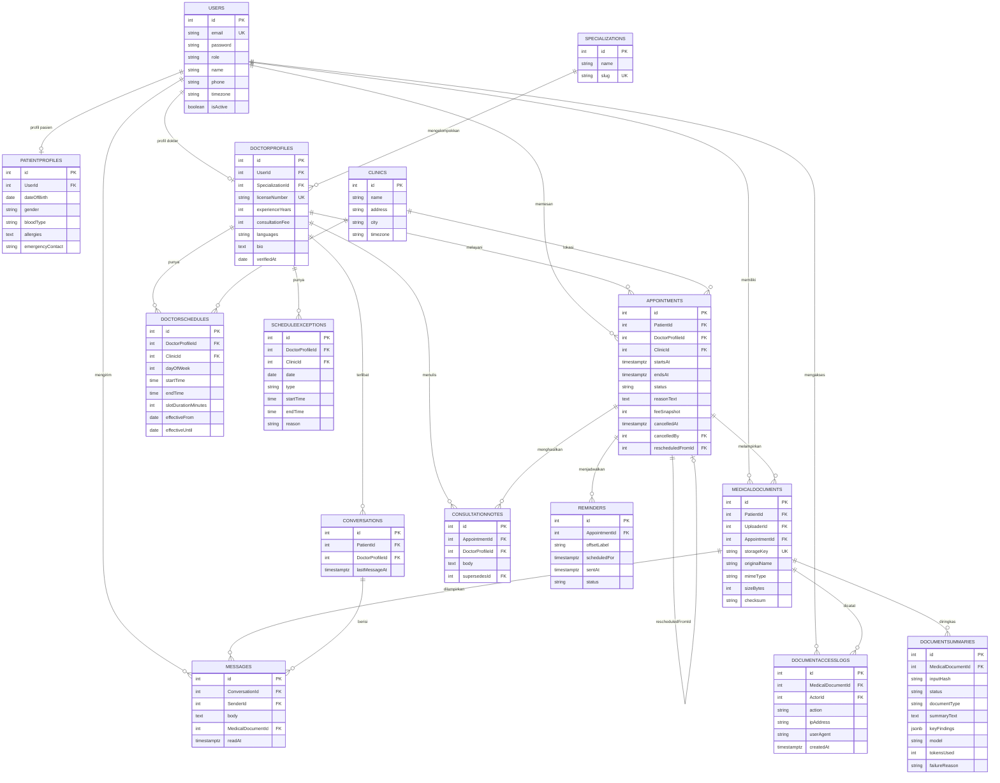

# ERD.md — Relasi Antar Tabel

> Kolom lengkap ada di `ARCHITECTURE.md §2`. File ini menjelaskan **relasi,
> constraint, dan aturan integritas** — hal-hal yang kalau salah, datanya rusak
> pelan-pelan tanpa ketahuan.

---

## 1. Diagram



Slot ketersediaan tidak ada di diagram ini karena **bukan tabel** — dihitung
real-time oleh `availabilityService` (`SPEC.md §4`).

## 2. Kardinalitas

| Relasi | Kardinalitas | Catatan |
|---|---|---|
| Users → PatientProfiles | 1 : 0..1 | Hanya untuk `role = 'patient'` |
| Users → DoctorProfiles | 1 : 0..1 | Hanya untuk `role = 'doctor'` |
| Specializations → DoctorProfiles | 1 : N | Satu dokter satu spesialisasi di v1.0 |
| DoctorProfiles → DoctorSchedules | 1 : N | Pola mingguan, bisa beda klinik |
| DoctorProfiles → Appointments | 1 : N | |
| Users(patient) → Appointments | 1 : N | |
| Appointments → Appointments | 1 : 0..1 | `rescheduledFromId` untuk rantai reschedule |
| Appointments → MedicalDocuments | 1 : N | Nullable — dokumen bisa berdiri sendiri |
| MedicalDocuments → DocumentSummaries | 1 : N | Beda `inputHash` = ringkasan baru |
| MedicalDocuments → DocumentAccessLogs | 1 : N | Append-only |
| Conversations → Messages | 1 : N | |
| Appointments → ConsultationNotes | 1 : N | Revisi jadi baris baru, bukan update |
| Appointments → Reminders | 1 : N | Maksimal 2 per janji temu (`h_24`, `h_2`) |

## 3. Constraint yang Wajib Ada di Migration

### Unique
```sql
UNIQUE ("Users"."email")
UNIQUE ("PatientProfiles"."UserId")
UNIQUE ("DoctorProfiles"."UserId")
UNIQUE ("DoctorProfiles"."licenseNumber")
UNIQUE ("Specializations"."slug")
UNIQUE ("MedicalDocuments"."storageKey")
UNIQUE ("Conversations"."PatientId", "Conversations"."DoctorProfileId")
UNIQUE ("Reminders"."AppointmentId", "Reminders"."offsetLabel")
UNIQUE ("DocumentSummaries"."MedicalDocumentId", "DocumentSummaries"."inputHash")
UNIQUE ("ScheduleExceptions"."DoctorProfileId", "ScheduleExceptions"."date",
        "ScheduleExceptions"."type", "ScheduleExceptions"."startTime")
```

### Partial unique index — INI PENGAMAN DOUBLE-BOOKING
```sql
-- Satu dokter tidak boleh punya dua janji temu aktif di jam yang sama
CREATE UNIQUE INDEX one_active_appointment_per_doctor_slot
  ON "Appointments" ("DoctorProfileId", "startsAt")
  WHERE status IN ('scheduled', 'confirmed');

-- Satu pasien tidak boleh punya dua janji temu aktif di jam yang sama
CREATE UNIQUE INDEX one_active_appointment_per_patient_slot
  ON "Appointments" ("PatientId", "startsAt")
  WHERE status IN ('scheduled', 'confirmed');
```

**Kenapa `WHERE status IN (...)`:** janji temu yang dibatalkan harus membebaskan
slotnya, tapi barisnya tidak boleh dihapus. Unique index biasa akan menahan
booking ulang di jam yang sama selamanya.

**Kenapa index, bukan pengecekan di service:** dua request booking yang datang
bersamaan sama-sama akan melihat slot kosong pada `SELECT`, lalu sama-sama
`INSERT`. Hanya database yang bisa menengahi. Pengecekan di service hanya untuk
pesan error yang enak dibaca, bukan pengaman.

### Check
```sql
CHECK ("Users"."role" IN ('patient','doctor','admin'))
CHECK ("DoctorProfiles"."consultationFee" >= 0)
CHECK ("DoctorProfiles"."experienceYears" >= 0)
CHECK ("DoctorSchedules"."dayOfWeek" BETWEEN 0 AND 6)
CHECK ("DoctorSchedules"."startTime" < "DoctorSchedules"."endTime")
CHECK ("DoctorSchedules"."slotDurationMinutes" > 0)
CHECK ("ScheduleExceptions"."type" IN ('off','extra'))
CHECK ("ScheduleExceptions"."type" <> 'extra' OR ("ClinicId" IS NOT NULL
       AND "startTime" IS NOT NULL AND "endTime" IS NOT NULL))
CHECK ("Appointments"."status" IN ('scheduled','confirmed','completed','cancelled','no_show'))
CHECK ("Appointments"."endsAt" > "Appointments"."startsAt")
CHECK ("Appointments"."feeSnapshot" >= 0)
CHECK ("Appointments"."status" <> 'cancelled' OR "cancelledAt" IS NOT NULL)
CHECK ("MedicalDocuments"."mimeType" IN ('application/pdf','image/jpeg','image/png'))
CHECK ("MedicalDocuments"."sizeBytes" > 0)
CHECK ("DocumentSummaries"."status" IN ('pending','done','failed','rejected'))
CHECK ("DocumentSummaries"."status" <> 'done' OR "summaryText" IS NOT NULL)
CHECK ("DocumentAccessLogs"."action" IN
       ('upload','view_url_issued','summary_requested','delete_requested'))
CHECK ("Messages"."body" IS NOT NULL OR "MedicalDocumentId" IS NOT NULL)
CHECK ("Reminders"."offsetLabel" IN ('h_24','h_2'))
CHECK ("Reminders"."status" IN ('pending','sent','cancelled'))
```

### Index (query yang paling sering dipakai)
```sql
CREATE INDEX ON "Appointments" ("DoctorProfileId", "startsAt");
CREATE INDEX ON "Appointments" ("PatientId", "startsAt" DESC);
CREATE INDEX ON "Appointments" ("status", "startsAt");
CREATE INDEX ON "DoctorSchedules" ("DoctorProfileId", "dayOfWeek");
CREATE INDEX ON "ScheduleExceptions" ("DoctorProfileId", "date");
CREATE INDEX ON "DoctorProfiles" ("SpecializationId", "consultationFee")
  WHERE "verifiedAt" IS NOT NULL;
CREATE INDEX ON "MedicalDocuments" ("PatientId");
CREATE INDEX ON "DocumentAccessLogs" ("MedicalDocumentId", "createdAt" DESC);
CREATE INDEX ON "Messages" ("ConversationId", "id" DESC);
CREATE INDEX ON "Reminders" ("status", "scheduledFor");
```

### Perilaku ON DELETE
| Foreign key | Perilaku | Kenapa |
|---|---|---|
| `Appointments.PatientId` | `RESTRICT` | Riwayat medis tidak boleh hilang bersama akun |
| `Appointments.DoctorProfileId` | `RESTRICT` | Idem |
| `MedicalDocuments.PatientId` | `RESTRICT` | Dokumen medis tidak ikut terhapus |
| `MedicalDocuments.AppointmentId` | `SET NULL` | Dokumen tetap milik pasien walau janji temunya hilang |
| `DocumentSummaries.MedicalDocumentId` | `CASCADE` | Cache, aman dibuang |
| `DocumentAccessLogs.MedicalDocumentId` | `RESTRICT` | **Audit trail tidak pernah ikut terhapus** |
| `DoctorSchedules.DoctorProfileId` | `CASCADE` | Jadwal tanpa dokter tidak ada artinya |
| `ConsultationNotes.AppointmentId` | `RESTRICT` | Catatan klinis harus utuh |
| `Messages.MedicalDocumentId` | `SET NULL` | Chat tetap terbaca walau lampiran dicabut |
| `Reminders.AppointmentId` | `CASCADE` | Pengingat tanpa janji temu tidak ada artinya |

`RESTRICT` di `DocumentAccessLogs` berarti dokumen medis **tidak bisa dihapus
lewat SQL biasa**. Itu disengaja. Penghapusan permanen adalah prosedur manual,
bukan fitur.

## 4. Aturan yang TIDAK Bisa Dijaga Database (jadi wajib ada test-nya)

Ini yang paling sering bocor. Database tidak bisa menahannya, jadi kode dan test
yang harus.

1. **Ketersediaan tidak pernah disimpan.** Selalu `availabilityService.build()`.
   Tidak ada tabel, tidak ada cache slot, tidak ada kolom `isAvailable`.
2. **`Appointments.startsAt` harus tepat di batas slot.** DB hanya bisa mengecek
   `endsAt > startsAt`. Bahwa jam 10:07 bukan awal slot yang sah adalah urusan
   `availabilityService`.
3. **`Appointments.ClinicId` harus sama dengan klinik pada jadwal dokter di hari itu.**
   FK biasa tidak bisa mengecek ini.
4. **Transisi status hanya yang ada di `SPEC.md §7`.** DB hanya tahu daftar nilai
   yang sah, bukan urutannya.
5. **Role tidak pernah dicek di luar `accessService`.**
6. **Setiap penerbitan signed URL wajib menghasilkan satu baris
   `DocumentAccessLogs`.** Tidak ada trigger yang menjaminnya.
7. **Admin tidak pernah bisa membaca dokumen medis.** Ini aturan kode, bukan FK.
8. **`DocumentAccessLogs` append-only.** Service tidak pernah `UPDATE` atau
   `DELETE` baris di tabel ini.
9. **`ConsultationNotes` append-only.** Revisi = baris baru dengan `supersedesId`.
10. **Teks dokumen wajib melewati `deidentify.py` sebelum ke LLM.**
11. **Satu catatan konsultasi hanya boleh direvisi sekali per rantai.** Revisi atas
    catatan yang sudah punya penerus → 400.
12. **`feeSnapshot` diisi saat booking dan tidak pernah di-update**, walaupun
    dokter mengubah `consultationFee`.

## 5. Seed Data Awal

**Specializations** (slug dalam kurung):
Umum (`umum`), Kardiologi (`kardiologi`), Penyakit Dalam (`penyakit-dalam`),
Anak (`anak`), Kandungan (`kandungan`), Saraf (`saraf`), Kulit & Kelamin
(`kulit-kelamin`), THT (`tht`), Mata (`mata`), Gigi (`gigi`), Ortopedi
(`ortopedi`), Psikiatri (`psikiatri`)

**Clinics:** minimal 2 untuk pengujian, dengan `city` berbeda.

**Admin pertama** dibuat lewat seeder, bukan lewat `/api/auth/register`.
Endpoint register **hanya** menerima `role: 'patient'`.

Spesialisasi yang sudah dipakai `DoctorProfiles` tidak boleh dihapus → tolak 400.

## 6. Contoh Data Setelah Satu Booking

Pasien memesan slot 09:00 WIB (02:00 UTC) tanggal 5 September 2026:

```
Users:            { id: 4, email: 'rina@mail.com', role: 'patient', name: 'Rina' }
Users:            { id: 9, email: 'dr.adi@mail.com', role: 'doctor', name: 'dr. Adi' }
DoctorProfiles:   { id: 7, UserId: 9, SpecializationId: 2, consultationFee: 180000,
                    verifiedAt: '2026-07-01' }
DoctorSchedules:  { id: 15, DoctorProfileId: 7, ClinicId: 2, dayOfWeek: 6,
                    startTime: '09:00', endTime: '12:00', slotDurationMinutes: 30 }
Appointments:     { id: 88, PatientId: 4, DoctorProfileId: 7, ClinicId: 2,
                    startsAt: '2026-09-05T02:00:00Z', endsAt: '2026-09-05T02:30:00Z',
                    status: 'scheduled', feeSnapshot: 180000,
                    cancelledAt: null, rescheduledFromId: null }
Reminders:        { id: 120, AppointmentId: 88, offsetLabel: 'h_24',
                    scheduledFor: '2026-09-04T02:00:00Z', status: 'pending' }
Reminders:        { id: 121, AppointmentId: 88, offsetLabel: 'h_2',
                    scheduledFor: '2026-09-05T00:00:00Z', status: 'pending' }
```

Pasien lain yang memesan slot **persis sama** → `INSERT` ditolak
`one_active_appointment_per_doctor_slot` → aplikasi membalas `409`.
**Tidak ada baris kedua yang tersimpan.**

Setelah pasien membatalkan:
```
Appointments:  { id: 88, ..., status: 'cancelled', cancelledAt: '2026-09-03T04:12:00Z',
                 cancelledBy: 4 }
Reminders:     { id: 120, ..., status: 'cancelled', sentAt: null }
Reminders:     { id: 121, ..., status: 'cancelled', sentAt: null }
```
Baris `Appointments` tetap ada, dan slot 02:00 UTC kembali muncul di
`GET /api/doctors/7/availability` karena partial index tidak lagi menahannya.
